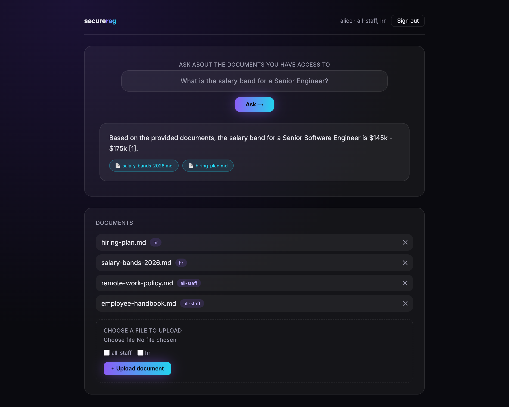
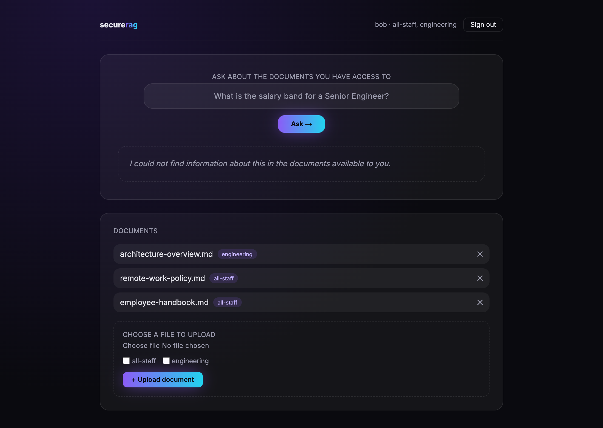

# secure-rag-java


An AI assistant for a company's internal documents that answers each user only from the
documents that user is allowed to read.

Users upload documents (PDF, DOCX and other formats) and ask questions about them in plain
language. The service finds the relevant passages, generates an answer with an LLM and returns it
with links to the source documents.

What sets it apart from a regular RAG chatbot is **need-to-know access control**. Every document
has an owner and an access list. When Alice and Bob ask the same question, each gets an answer
built only from their own permitted documents. Bob cannot get anything out of Alice's documents,
however he phrases the question.

## See it in action

The same question — *"What is the salary band for a Senior Engineer?"* — asked by two employees
of the same company, against the same set of documents:

**Alice (HR)** has access to the salary document, so she gets an answer with its sources cited:



**Bob (Engineering)** is not entitled to HR documents. For him they simply do not exist: nothing is
retrieved, nothing is cited, and the assistant says it has no information. His document list does
not even show that the salary document is there:



The screenshots come from a local run with demo data (`./mvnw spring-boot:test-run`, see
[Running](#running)). The access decision is made from the user's signed token and applied inside
the database query, before any text reaches the language model.

### How access is enforced

- The user is identified by a JWT from Keycloak or Microsoft Entra ID. Access rights come only from
  the token, never from request parameters.
- Every text chunk in the vector index carries the access list of its source document.
- The access filter runs **inside** the pgvector similarity search, not afterwards. Forbidden
  chunks never reach the model, the answer or the citations.
- A document the user may not read returns `404`, so its existence is not revealed either.
- Retrieved text and model output are treated as untrusted: an instruction hidden in a document
  cannot widen access, because access is decided before the model runs.
- Citations are built from the chunks actually retrieved for the caller, never from what the model
  writes in its answer.
- **Access matrix tests** check that Bob cannot reach Alice's documents through search, chat, `GET`
  or `DELETE`, over HTTP against a real pgvector database.

## Stack

Java 25 · Spring Boot 4.1 · Spring Security (OAuth2 Resource Server) · Spring AI 2.0 ·
PostgreSQL 17 + pgvector · Spring Data JPA · Flyway · Apache Tika · Testcontainers

### Why these choices

**One database, not a database plus a separate vector store.** Document metadata, the access-control
list and the embeddings all live in the same PostgreSQL instance (pgvector extension). That isn't a
shortcut — it's what makes the core guarantee of this project actually enforceable: the ACL filter
runs as part of the *same* SQL query that does the similarity search (a `jsonpath` predicate inside
the `WHERE` clause — see `AccessFilter`), not as a second call to a second system afterward. A
document's access list and its vectors can never drift out of sync because they're never
transactionally separate in the first place. It also means one backup story, one HA story, and
standard Postgres tooling (`pg_dump`, replication, `EXPLAIN`) instead of operating a second piece of
infrastructure just for vectors.

**The model provider is a configuration choice, not a code dependency.** Business logic depends only
on Spring AI's `ChatModel` / `EmbeddingModel` / `VectorStore` abstractions — never on a vendor SDK
directly. That's proven by having three genuinely different chat backends behind the same interface,
selected purely by Spring profile:

| Profile | Chat | Embeddings | Good for |
|---|---|---|---|
| default | OpenAI | OpenAI | production |
| `azure` | Azure OpenAI | Azure OpenAI | regulated / enterprise environments already on Azure |
| `test` (+ `LM_STUDIO=1`) | Local, via [LM Studio](https://lmstudio.ai) | Local ONNX | fully offline demo — no API key, no cost, no data leaves the machine |

Embeddings stay on the same local ONNX model (`all-MiniLM-L6-v2`) in every non-production profile,
regardless of which chat backend is active — the vector dimension is fixed in the schema, so switching
chat providers never risks a silent mismatch there.

## Running

Requires JDK 25 and Docker.

```bash
./mvnw spring-boot:test-run                             # no API keys, local ONNX embeddings, demo data
LM_STUDIO=1 ./mvnw spring-boot:test-run                 # same, but real answers via a local LM Studio server
OPENAI_API_KEY=... ./mvnw spring-boot:run               # OpenAI
./mvnw spring-boot:run -Dspring-boot.run.profiles=azure # Azure OpenAI, see .env.example
./mvnw verify                                           # tests
```

Identity provider: Keycloak by default; `--spring.profiles.active=entra` switches to Microsoft Entra ID
(combine as `azure,entra`). Variables for every profile are in [`.env.example`](.env.example).

`LM_STUDIO=1` is a local convenience, not a deployment profile: it swaps the stub chat model that the
automated test suite always uses for a real one, by pointing at LM Studio's OpenAI-compatible local
server (default `http://127.0.0.1:1234`, overridable with `LMSTUDIO_BASE_URL` / `LMSTUDIO_MODEL`
env vars — see `application-lmstudio.properties`). It needs LM Studio running with a chat model loaded;
without the flag, `test-run` behaves exactly as documented above.

In production set `OPENAPI_ENABLED=false`. Actuator exposes only `health` (with liveness/readiness
probes, status only) and `info`.

### Frontend

A single-page UI (login, ask a question, upload/list/delete documents) lives in `frontend/` and is
statically exported into `src/main/resources/static/`, so it's served by the same app on the same
port — no separate process.

```bash
cd frontend && npm install && npm run build   # builds and copies into src/main/resources/static
cd .. && ./mvnw spring-boot:test-run           # open http://localhost:8080
```

Rebuild the frontend (`npm run build`) and restart the backend after every UI change — there's no
dev-server proxy. Keycloak/client config for local login lives in `frontend/.env.example`.

`compose.yaml` also starts Keycloak on http://localhost:8180 with the `securerag` realm
(admin console: `admin` / `admin`, local only). Demo users:

| User | Password | Groups |
|---|---|---|
| `alice` | `alice` | `all-staff`, `hr` |
| `bob` | `bob` | `all-staff`, `engineering` |

```bash
curl -s http://localhost:8180/realms/securerag/protocol/openid-connect/token \
  -d grant_type=password -d client_id=securerag-web -d username=alice -d password=alice
```

## API

OpenAPI document: `/v3/api-docs` · Swagger UI: `/swagger-ui.html`. In Swagger UI, **Authorize**
logs in through Keycloak (authorization code + PKCE, client `securerag-web`). Both pages are public
and can be switched off with `OPENAPI_ENABLED=false`.

| Method | Path | Description |
|---|---|---|
| `GET` | `/api/v1/me` | Caller's identity, groups and roles resolved from the token |
| `POST` | `/api/v1/documents` | Upload a PDF, DOCX, Markdown or text file; optionally share it with your groups |
| `GET` | `/api/v1/documents` | Your documents and those shared with your groups |
| `GET` | `/api/v1/documents/{id}` | One document; `404` if it is not visible to you |
| `DELETE` | `/api/v1/documents/{id}` | Delete your own document and all its chunks |
| `POST` | `/api/v1/search` | Semantic search over the documents you may read |
| `POST` | `/api/v1/chat` | Answer a question from the documents you may read, with citations |

## Roadmap

- [x] Project bootstrap, profiles, Testcontainers
- [x] Keycloak realm with demo users (`alice`, `bob`)
- [x] JWT resource server, entitlements from token claims, OpenAPI / Swagger UI
- [x] Documents schema and ingestion
- [x] ACL-filtered retrieval and chat with citations
- [x] Access-control tests: Bob cannot see Alice's documents (search, chat, get, delete)
- [x] Operations: actuator, logging, timeouts, Azure OpenAI and Entra ID

## License

[PolyForm Noncommercial 1.0.0](LICENSE.md): you may read, run and modify the code for any noncommercial purpose
(learning, evaluation, research, personal projects). Commercial use — in a business, for clients, or as part of a
product or service — needs a separate license from the author; [get in touch](https://github.com/AlexGorbatov).
